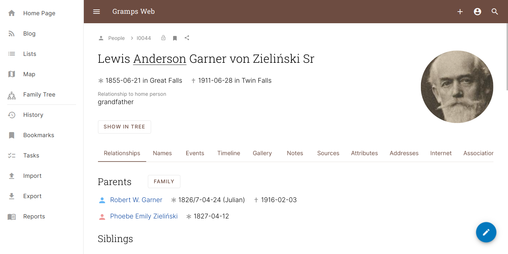

# Gramps.js

Gramps.js is a responsive frontend for the <a href="https://github.com/gramps-project/gramps-webapi/">Gramps Web API</a>. Together, they provide a modern web app that allows to browse and collaboratively edit a genealogical database created with the <a href="https://gramps-project.org">Gramps</a> desktop application.

## Screenshot




## Demo

A demo deployment based on the Gramps example family tree is available at https://grampsjs-demo.herokuapp.com.


## Deployment

The compiled Gramps.js is a static frontend that can be easily used with an existing Gramps Web API instance. For details how to deploy the Web API, see the [Gramps Web API docs](https://gramps-project.github.io/gramps-webapi/).


## Development setup

The app is based on <a href="https://open-wc.org/">Open Web Components</a> and <a href="https://lit.dev/">Lit</a>.

To get started with development, install Node.js with [`nvm`](https://github.com/nvm-sh/nvm):

```
nvm install node
```

Clone the repository and, at its root, run
```
npm install
```
to install dependencies.

A backend can be started with
```
python -m gramps_webapi --config path/to/config run --port 5555
```
(for details see https://gramps-project.github.io/gramps-webapi/).

You can now run the frontend with 
```
npm run start
```

To build the frontend for deployment, run
```
npm run build
```
